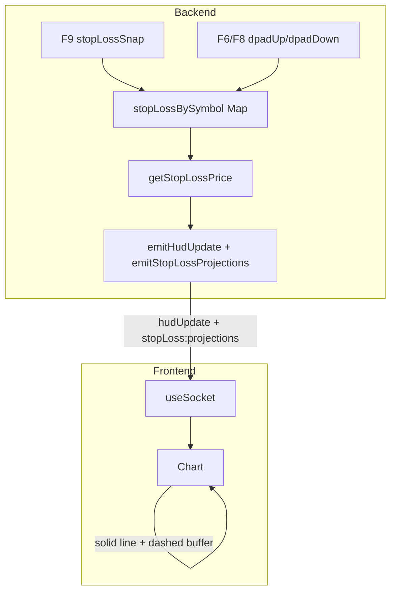

# Stop-Loss Plan: Per-Asset Storage, F9 Snap, Frontend Display

## Overview

- Store stop-loss **per symbol** (each asset keeps its own value).
- **F9** snaps the current primary asset's stop-loss to the current mark price.
- **F6/F8** move the stop-loss up/down for the current primary asset.
- Frontend shows the **stop-loss line** (lighter blue) and **fee buffer zone** (dashed lines) on the chart, with a legend and optional F9 hint.

---

## 1. Backend: Per-Symbol Stop-Loss Storage

**File:** [backend/server.js](backend/server.js)

**Replace:**
```js
let stopLossPrice = DEFAULT_STOP_LOSS_PRICE;
```

**With:**
```js
const stopLossBySymbol = new Map(); // symbol -> price (number)

function getStopLossPrice(symbol) {
  if (!symbol) return 0;
  const v = stopLossBySymbol.get(symbol);
  return Number.isFinite(v) && v > 0 ? v : 0;
}
```

**Update all usages of `stopLossPrice` to `getStopLossPrice(primarySymbol)` in:**
- `emitStopLossProjections()` (line ~527)
- `emitHudUpdate()` / `accountEmitHudUpdate` payload (line ~546)
- `socket.emit("initialState", ...)` (line ~696)
- Any other reference to `stopLossPrice`

**Update write sites (dpadUp / dpadDown):**
Moves stop-loss by an ATR-based step computed on the backend from recent
in-memory `1m` candles.

Formula:
- `k = settings.stopLossStep` (multiplier)
- `rawStep = ATR(14, 1m) * k`
- `tickInc` is derived from the smallest positive close-to-close move observed in recent candles
- `step = round UP rawStep to tickInc` so the step aligns with the chart's “lowest increment”

```js
if (action === "dpadUp") {
  const step = getAtrStopLossStep(); // uses ATR * k, rounded up to tickInc
  const current = getStopLossPrice(primarySymbol);
  const next = current + step;
  stopLossBySymbol.set(primarySymbol, next);
  console.log("stopLoss updated:", primarySymbol, next, "(step=" + step + ")");
  emitHudUpdate();
  emitControllerEvent(action);
  return;
}
if (action === "dpadDown") {
  const step = getAtrStopLossStep();
  const current = getStopLossPrice(primarySymbol);
  const next = Math.max(0, current - step);
  stopLossBySymbol.set(primarySymbol, next);
  console.log("stopLoss updated:", primarySymbol, next, "(step=" + step + ")");
  emitHudUpdate();
  emitControllerEvent(action);
  return;
}
```

---

## 2. Backend: F9 Snap Action

**File:** [backend/controller.js](backend/controller.js)

**Add mapping** (in `mapGlobalKeyNameToAction`):
```js
if (includesAny("F9", "KEY F9")) return "stopLossSnap";
```

**Update console log:**
```js
"F1=cross F2=triangle F3=circle F4/F5=primary F6/F8=stopLoss+/- F9=snap"
```

**File:** [backend/server.js](backend/server.js)

**Add handler** in `handleControllerAction` (before dpadUp/dpadDown):
```js
if (action === "stopLossSnap") {
  if (primarySymbol && lastPrice > 0) {
    stopLossBySymbol.set(primarySymbol, lastPrice);
    console.log("stopLoss snapped to price:", lastPrice, "for", primarySymbol);
    emitHudUpdate();
    emitControllerEvent("stopLossSnap");
  }
  return;
}
```

---

## 3. Backend: Emit Correct Stop-Loss Value

In `emitStopLossProjections()`, `emitHudUpdate()`, and `initialState`:

- Use `stopLossPrice = getStopLossPrice(primarySymbol)` instead of the old `stopLossPrice` variable.
- No change to `computeStopLossProjections` or fee buffer logic; it already uses real perps fee rates from `cachedFeeRates`.

---

## 4. Frontend: Stop-Loss Line and Fee Buffer Zone (Already Implemented)

**File:** [frontend/src/Chart.tsx](frontend/src/Chart.tsx)

- Receives `stopLossPrice` and `feeBufferPrice` as props.
- When `stopLossPrice > 0`: draws solid lighter-blue horizontal line at that price, labeled "SL".
- When `feeBufferPrice > 0`: draws two dashed horizontal lines at `stopLossPrice ± feeBufferPrice` (fee buffer zone).

**File:** [frontend/src/ChartPanel.tsx](frontend/src/ChartPanel.tsx)

- Gets `slPrice` from `stopLossProjections?.stopLossPrice ?? hud.stopLossPrice`.
- Gets `feeBuffer` from `stopLossProjections?.feeBufferPrice ?? 0`.
- Passes both to `<Chart stopLossPrice={slPrice} feeBufferPrice={feeBuffer} />`.
- Shows Long/Short projection box when projections exist.

No structural changes needed; it works once the backend sends non-zero values.

---

## 5. Frontend: Legend for SL and Fee Buffer

**File:** [frontend/src/ChartPanel.tsx](frontend/src/ChartPanel.tsx)

Add legend entries in the top-left overlay (next to Live/History/Mixed/Gaps, around line 127):

```jsx
<span className="inline-flex items-center gap-1">
  <span className="inline-block h-2 w-2 rounded-sm bg-sky-400" /> SL
</span>
<span className="inline-flex items-center gap-1">
  <span className="inline-block h-0.5 w-4 border-t-2 border-dashed border-sky-300" /> Fee buffer
</span>
```

---

## 6. Frontend: F9 Hint When No Line Visible

**File:** [frontend/src/ChartPanel.tsx](frontend/src/ChartPanel.tsx)

When `slPrice === 0` (no stop-loss set), show a subtle overlay hint:

```jsx
{slPrice === 0 && hud.price > 0 && (
  <div className="pointer-events-none absolute left-1/2 top-1/2 z-10 -translate-x-1/2 -translate-y-1/2 rounded-md border border-sky-200 bg-sky-50/90 px-3 py-1.5 text-xs font-medium text-sky-800 backdrop-blur">
    Press F9 to place stop-loss at current price
  </div>
)}
```

---

## 7. Data Flow



---

## 8. Controller Key Reference

| Key | Action |
|-----|--------|
| F1 | Cross (trade) |
| F2 | Triangle (50% close & BE) |
| F3 | Circle (bailout) |
| F4 | Previous primary asset |
| F5 | Next primary asset |
| F6 | Stop-loss up |
| F8 | Stop-loss down |
| F9 | Snap stop-loss to current price |

---

## 9. Checklist

- [ ] Replace `stopLossPrice` with `stopLossBySymbol` Map and `getStopLossPrice()`
- [ ] Update dpadUp/dpadDown to write to Map
- [ ] Add stopLossSnap handler and F9 mapping
- [ ] Update emitStopLossProjections, emitHudUpdate, initialState to use getStopLossPrice
- [ ] Add SL and Fee buffer legend entries in ChartPanel
- [ ] Add F9 hint overlay when slPrice is 0
- [ ] Verify Chart receives slPrice and feeBuffer and renders lines correctly
